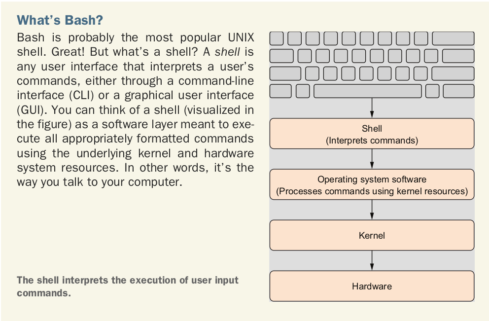
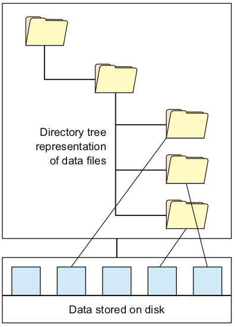
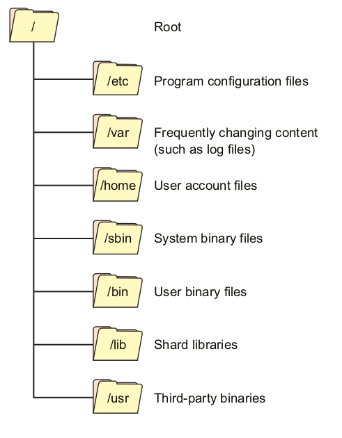

# Introducción a la línea de comandos

La línea de comandos, o **shell**, es la interfaz entre el usuario y los archivos y procesos que definen el estado de la computadora-incluyendo los archivos y procesos del sistema operativo. 

Podemos ingresar al shell al abrir una terminal. El shell proporciona una  *interface de linea de comando* (command line interface-CLI) que puede ser utilizada para ejecutar comandos y navegar a través del sistema de archivos del equipo. La línea de comandos también se le conoce como *prompt* y generalmente es denotado con un signo de pesos ($).

Pero, **¿Qué es exactamente el shell? El Shell es un lenguaje de programación**.

El shell es un lenguaje de programación que es ejecutado en la terminal. Al igual que otros lenguajes de programación, el shell:

* Puede recolectar muchas operaciones e integrarlas en una unidad.
* Aceptar insumos.
* Generar salidas.
* Tiene variables y estados.
* Caracteres especiales y nombres reservados.

Al igual que los lenguajes de programación, hay muchos shells. Uno de los shells más utilizados es **bash**. Otro shell famoso es **zsh**. 


<p></p>

El poder del shell se define por su transparencia. Al proporcionar acceso directo al sistema de archivos completo, el shell puede ser utilizado para efectuar casi cualquier tarea como :

* Encontrar archivos.
* Manipular archivos. 
* Instalar paquetes.
* Ejecutar programas.
* **Navegar por el sistema de archivos**

## Sistema de Archivos de Linux

Un sistema de archivos es un conjunto de estructuras de datos que determina la forma como los datos del usuario son organizados en una unidad de almacenamiento. Los usuarios finales son capaces de interactuar con el sistema de archivos mediante métodos de acceso a archivos regulares. La gran mayoría de distribuciones modernas de Linux usan ya sea **XFS** o **Ext4** como sistemas de archivos por default. En ambos casos, estos sistemas de archivos crean conexiones jerárquicas entre archivos individuales y grupos de archivos con ubicaciones identificables (mediante indización) en la unidad de almacenamiento.  

<p></p>

¿Por qué necesitamos indizar la organización de nuestros archivos? Las unidades de almacenamiento proporcionan el medio físico de almacenamiento. El sistema de archivos proporciona el mecanismo lógico de organización de la información en esa unidad física de almacenamiento mediante la indización. El sistema de archivos usa la indización para proporcionar la apariencia de un conjunto organizado de directorios y archivos dentro de una división independiente de la unidad de almacenamiento conocida como **partición**.


Todos los archivos en una partición se guardan en directorios debajo del directorio **root** (*raíz*), que está representado por el carácter / (barra diagonal). La forma en que están organizados estos directorios se rige en gran medida por el estándar de jerarquía del sistema de archivos UNIX (UNIX Filesystem Hierarchy Standard -FHS)

<p></p>

## Herramientas de navegación en Linux

Las instrucciones más elementales de navegación en Linux son:
* ```ls```
* ```pwd```
* ```cd```
* ```cat```
* ```less``` 

### Instrucción ```ls``` 

Para listar los nombres de archivos y subdirectorios en el directorio actual, utilizamos la instrucción ```ls```. Si además agregamos la bandera ```l``` la instrucción muestra el nombre de los objetos, los permisos, el propietario, el grupo, el tamaño, y el time stamp del archivo. Si ejecutamos la instrucción ```ls -l``` en el directorio ```\var```, obtenemos la siguiente salida:
```bash
[vader@n0 ~]$ ls -l /var
total 8
drwxr-xr-x.  2 root root    6 Apr 10  2018 adm
drwxr-xr-x.  5 root root   44 Oct 30  2020 cache
drwxr-xr-x.  2 root root    6 Oct  1  2020 crash
drwxr-xr-x.  3 root root   34 Feb 17 12:32 db
drwxr-xr-x.  3 root root   18 Oct 30  2020 empty
drwxr-xr-x.  2 root root    6 Apr 10  2018 games

```

En la instrucción anterior estamos utilizando la **ruta absoluta** del directorio ```/var```. La ruta o espacio donde se encuentran nuestros archivos está hecho de directorios (folders o carpetas) anidados. En la jerga UNIX, la ubicación de cada directorio (y de cada archivo dentro de él) está dada por el **path** o **ruta**. Las rutas pueden ser **absolutas** o **relativas**. Una ruta es absoluta si esta empieza desde la raíz del arbol del sistema de archivos. Por lo tanto, las rutas absolutas siempre inician con / (por ejemplo, ```/var```).

Las rutas pueden ser **relativas** a nuestro directorio de trabajo actual. El directorio de trabajo actual es denotado con un punto (.) mientras que el directorio inmediatamente arriba de este (su **padre**) es denotado con dos puntos (..).

### Instrucción ```pwd``` (present work directory)

Pero, *¿en qué directorio de trabajo me encuentro actualmente?* La instrucción ```pwd``` imprimirá el directorio de trabajo actual:
```bash
[vader@n0 ~]$ pwd
/home/vader
```

### Instrucción ```cd``` (change directory)

Una vez que tenemos idea de dónde nos encontramos, nos gustaría cambiar de directorio. La instrucción ```cd``` nos permite movernos entre directorios al suministrar como argumento la ruta absoluta o relativa a donde deseamos dirigirnos. 

Por ejemplo, si queremos dirigirnos al directorio raíz, ejecutamos:

```bash
[vader@n0 ~]$ cd /
[vader@n0 /]$ 
```

Si eres muy atento, te darás cuenta que el caracter de tilde (```~```) cambió a /. El shell inicia sesión desde un directorio especial llamado el directorio **home**. El caracter de tilde (```~```) es utilizado como un shortcut al directorio home del usuario. 